# ☝ 13est : Best


## 🌎 Proejct : Best Place

  <div align="center"></div>


## 📢 Information

📅 개발 기간 | 2023. 09. 04 ~ 2023. 09. 24

📌 프로젝트 주제 | 맛집 예약 및 리뷰 SNS 서비스
  * 모바일 뷰를 전제로 만들었습니다. 

[📑발표자료](https://www.miricanvas.com/v/12flll1)

[🔗배포주소](https://13est-place.netlify.app/)
  * 테스트용 계정 ID: best1234 / PW: best1234


## 🤗 Team

Name | Profile |GitHub 
----- | ----- | -----
**김규민** |<div align="center">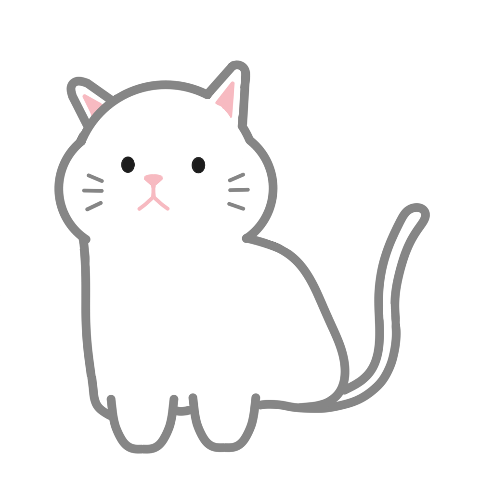</div> | https://github.com/migugin
**백상호** |<div align="center"></div> | https://github.com/bigCoDult
**신현주** |<div align="center"></div> | https://github.com/shju0317
**차지훈** |<div align="center"></div> | https://github.com/cfgop23


## 📐 Convention
  [📏 Coding Convention](https://github.com/FRONTENDSCHOOL6/13est-place/wiki/Coding-Convention)

  [📏 Commit Convention](https://github.com/FRONTENDSCHOOL6/13est-place/wiki/Commit-Convention)


## 🤗 Introduce

 지역별, 음식 카테고리별 식당 리뷰 컨텐츠 제공 및 예약/리뷰 서비스
 
 주요기능
  - 회원가입/로그인
  - 지역별, 음식 카테고리별 필터링
  - 관심지역 설정
  - 식당 예약
  - 리뷰 쓰기
  - 내 예약, 주문 확인
  - 관심 장소 저장
  

## 🔨 Stack

       

## 🔧 Tools

    

## 🎨 Cooperation

  


## 👀 Preview

Page | Preview | Description 
----- | ----- | -----
로그인 | 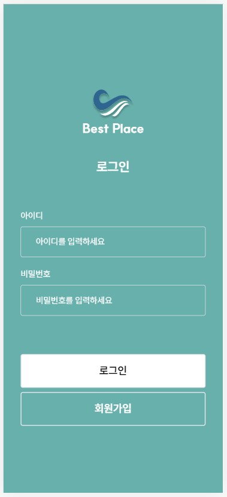 | 아이디/비밀번호 일치 확인
회원가입 |  | 아이디/이메일/비밀번호 validation
프로필수정 | 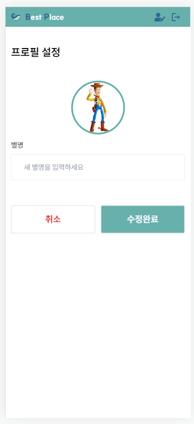 | 프로필 사진/닉네임 수정
팔로우 |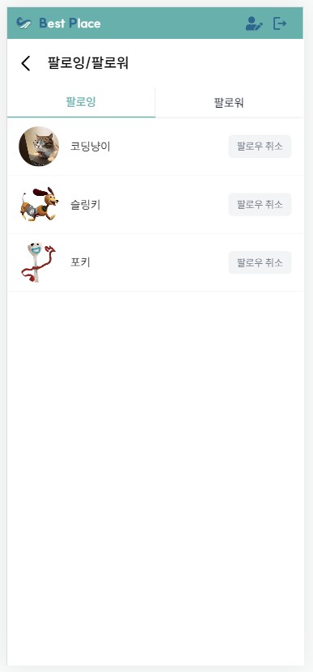 | 팔로잉, 팔로워 리스트
피드 | 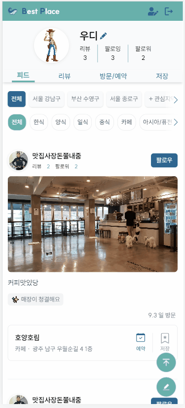 | 리뷰 정보 리스트<br/>지역별/음식카테고리별 필터링
리뷰 | 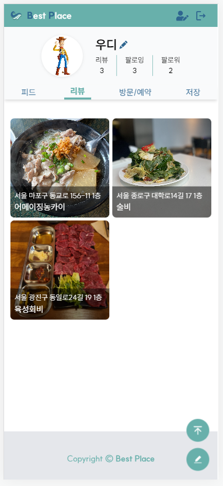 | 내가 쓴 리뷰 리스트
방문/예약 | 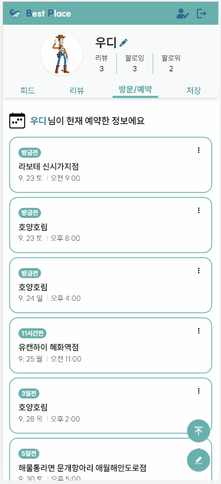 | 내가 방문/예약한 장소 리스트
저장 | 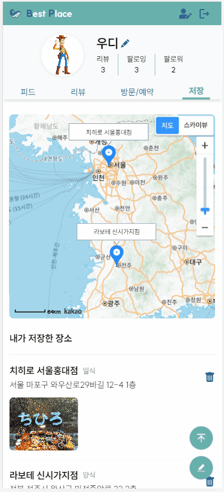 | 내가 저장한 장소 리스트
리뷰작성 | 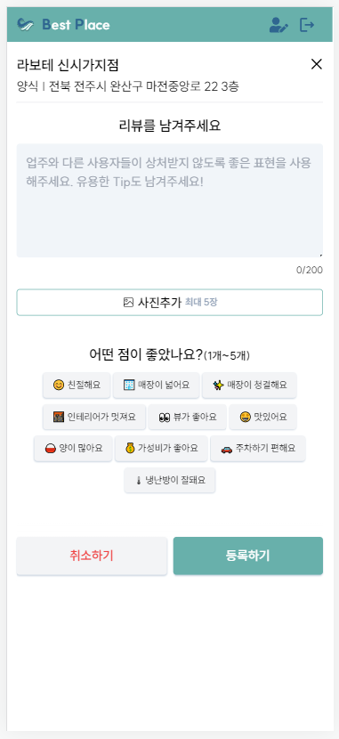 | 사진 수/키워드 수/공란 validation
예약작성 | 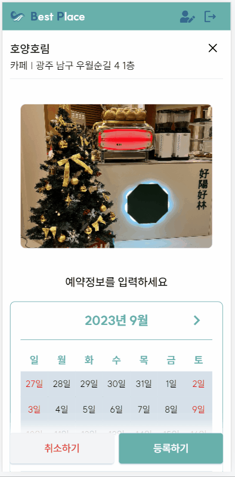 | 시간/인원/전화번호/이메일/공란 validation
에러페이지 | 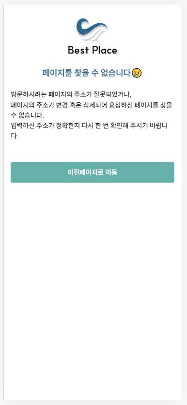 | 이전페이지로 이동


## 📚 DB Collection (Pocket Host)

name | fields
----- | -----
users | username, email, nickname, avatar, review, regions, favorites
follow | owner, followings, followers
places | title,  category, address, photos
reservation | booker, place, date, reservedName, guestCount, tel, requirements, visited, canceled
reviews | writer, place, reservation, contents, photos, keywords


## ⏲ Performance inspection
<div align="center">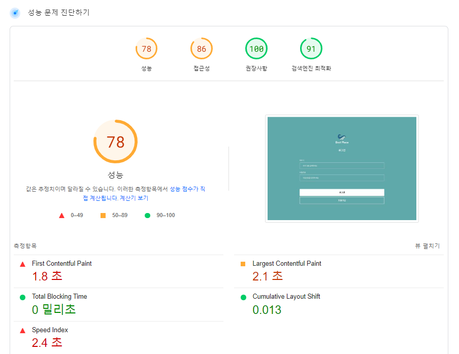</div>


## 💬 How to use?
  1️⃣ ```git clone https://github.com/FRONTENDSCHOOL6/13est-place.git``` 

  2️⃣ ```pnpm i```

  3️⃣ ```pnpm dev```
